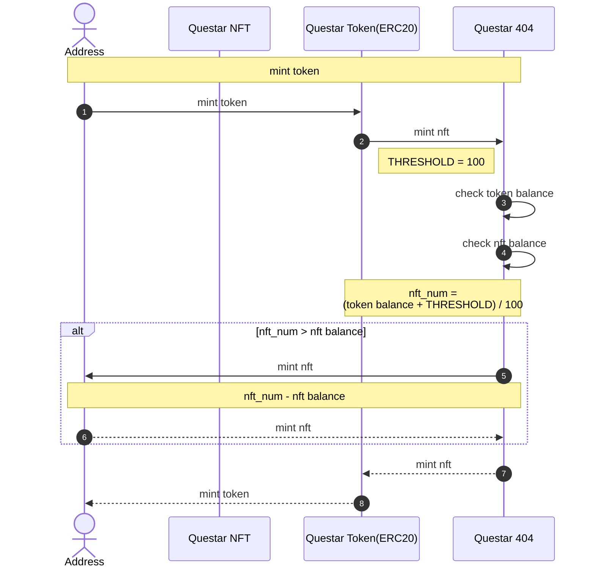

# Mint Token

```mermaid
sequenceDiagram
    actor user as Address
    autonumber
    participant nft as Questar NFT
    participant token as Questar Token(ERC20)
    participant erc404 as Questar 404

    Note over user,erc404: mint token
    user->>token: mint token
    token->>erc404: mint nft
    Note right of token: THRESHOLD = 100
    erc404->>erc404: check token balance
    erc404->>erc404: check nft balance
    Note over token,erc404: nft_num = <br />(token balance + THRESHOLD) / 100
    alt nft_num > nft balance
        erc404->>user: mint nft
        Note over user,erc404: nft_num - nft balance
        user-->>erc404: mint nft
    end
    erc404-->>token: mint nft
    token-->>user: mint token
```
