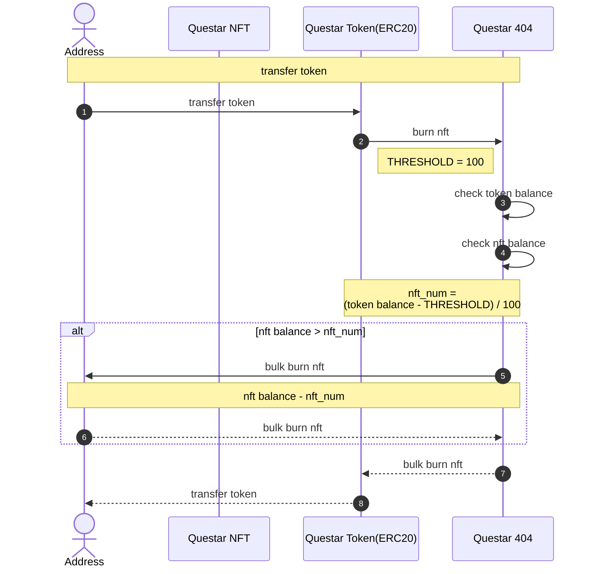

# Transfer Token

```mermaid
sequenceDiagram
    actor user as Address
    autonumber
    participant nft as Questar NFT
    participant token as Questar Token(ERC20)
    participant erc404 as Questar 404

    Note over user,erc404: transfer token
    user->>token: transfer token
    token->>erc404: burn nft
    Note right of token: THRESHOLD = 100
    erc404->>erc404: check token balance
    erc404->>erc404: check nft balance
    Note over token,erc404: nft_num = <br />(token balance - THRESHOLD) / 100
    alt nft balance > nft_num
        erc404->>user: bulk burn nft
        Note over user,erc404: nft balance - nft_num
        user-->>erc404: bulk burn nft
    end
    erc404-->>token: bulk burn nft
    token-->>user: transfer token
```
